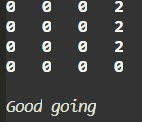
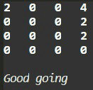

# python

## 2048 Game Description:

  Game's aim is to reach certain target No. by moving numbers horizontally or vertically which adds arithmetically same adjacent numbers in row or column. 

### Installing guide for Ubantu OS:

1) Clone this repository on your device
2) Install all dependencies using `pip install -r requirments.txt`
3) Run file using `python3 py2048.py`

### How-To:

1) Run file using `python3 py2048.py` or `python py2048.py` depending on your system conditions.
2) Enter dimensions of game you want to play.
3) Next enter Target you want to reach as power of 2, 
    For example if your target is 64 you should enter 6 as 2^6 = 64.
4) Enjoy the game..:)
5) After game is complete enter any key to continue further.

### Rules to know:
1) If you don't enter Dimensions or Target, default Dimensions and Target are 4 and 2048 respectively.
2) After every move 2 will be added to board at random position.
3) If any other keys except arrow and wasd keys are used game will stopped for around a second and you will loose one move.
4) If your Target and Dimensions are Default values i.e, 2048, 4 respectively; Game will continue forward after winning until you're uot of moves.
 
### Codes Explaination:
Moving numbers algorithem is most important part of this game and also most complicated:
Here is an explanation of one of the function:

 `def hori_move_right(l):`
    
    `for row in l:
         for j in range((len(row)-1),0,-1):
             y = 1
             craowling = True
             while craowling == True and j-y >= 0:
                
                 if row[j] == 0 and row[j] < row[j-y]:
                    row[j],row[j-y] = row[j-y],row[j]
                    
                 elif row[j] == row[j-y] and row[j] != 0:
                     row[j] = row[j]+row[j-y]
                     row[j-y] = 0 
                     craowling = False      
                
                 elif row[j] != row[j-y] and row[j-y] != 0:
                     craowling = False    
                 y += 1        
     return l`
#### There are three cases to look:
Basically function at an instance holds to an element and then moves to adjacent elements comparing according two given three cases:

##### Case 1:
  1st if condition does the job of moving elements across zeros.
  
  

##### Case 2:
  
  2nd elif condition is only for adding same numbers.
  
  
  
##### Case 3:
  
  3rd elif condition make sure that function stops at next number greater than zero.
  
  

    
